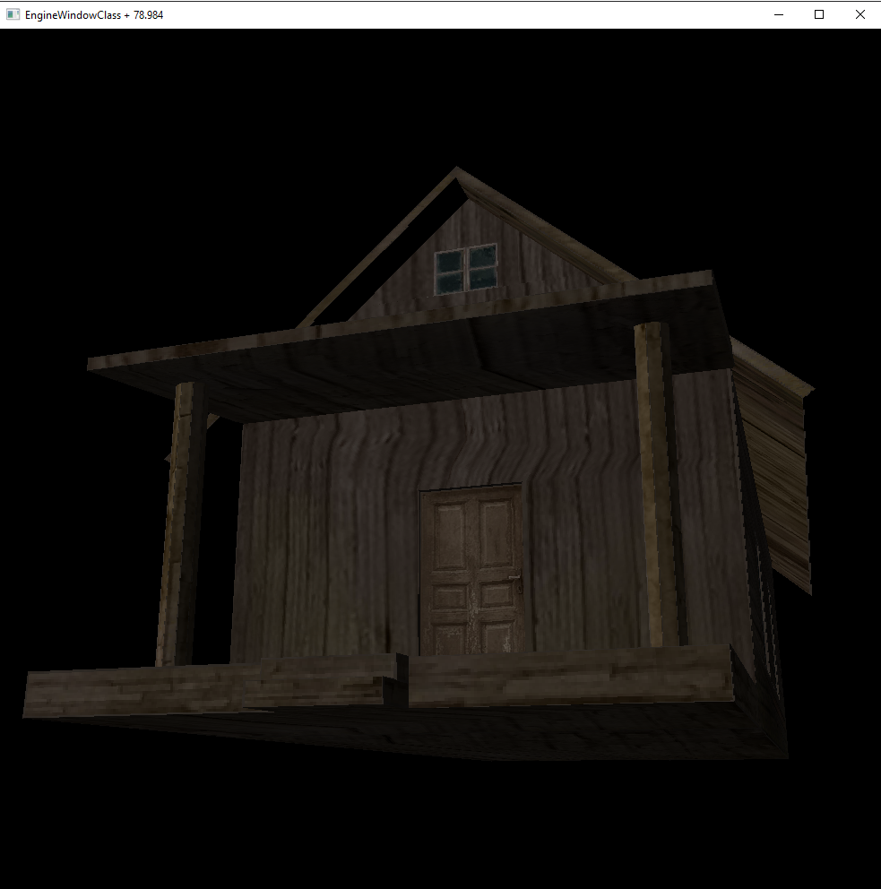

# 3D-Graph-Learn

A software (CPU) 3D renderer written in C++ for Windows. Everything is done by
hand: matrix math, triangle rasterization, a Z-buffer, clipping and texture
mapping — no OpenGL, no DirectX, no third-party engine. The only external code
is [stb_image](https://github.com/nothings/stb) for decoding image files; the
frame is pushed to a window through Win32 and GDI.

A learning project from 2021–2022, written to understand how a graphics
pipeline works from the inside. The code reflects where I was back then.

## What is implemented

- Custom `Vector<N>` and `Matrix<M, N>` class templates with the algebra needed
- Perspective projection, a free-look camera, perspective division
- Triangle rasterization with scanline filling and a Z-buffer
- Polygon clipping against the four screen edges and the near/far planes
- Back-face culling from the dot product of the face normal and the view direction
- Texture mapping (affine, in screen space) and simple diffuse shading from the
  face normal
- Wavefront OBJ loading together with MTL materials and their textures
- Caching model and texture factories, so a file is never read twice

## Building and running

You need Visual Studio 2019 or newer with the "Desktop development with C++"
workload. Open `3D-Graph-Learn.sln`, pick the x64 configuration and build.

Asset paths are resolved from the location of the executable, and the build
copies `models/` next to it, so the program can be started from anywhere,
including a double click in Explorer.

## Controls

| Key | Action |
|---|---|
| W / A / S / D | move the camera |
| Mouse | look around |
| Esc | quit |

## Assets

The `models/Izba` model and its textures are third-party, used here for
learning purposes and owned by their authors. `stb_image.h` is MIT / public
domain, by Sean Barrett.
